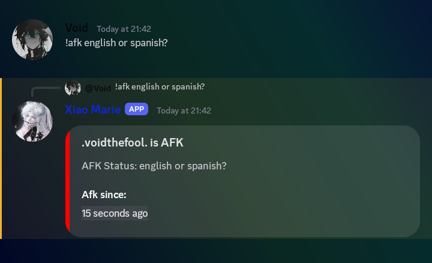

## Afks

### Overview

The Afk feature allows users to set a custom away message.

## Commands

### Afk

**Description:** This command sets your away message.

**Command:** `!afk <message>`

**Example:**
- **`!afk`** `you made me rage quit, bye.`
