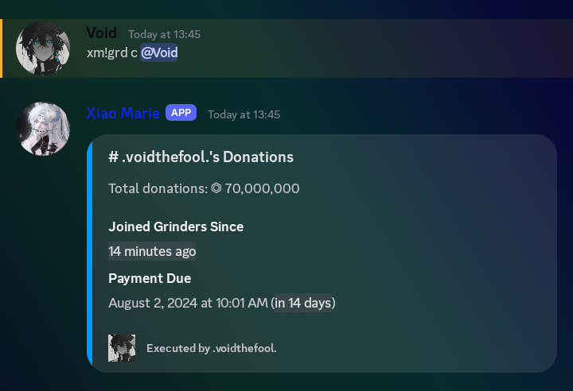
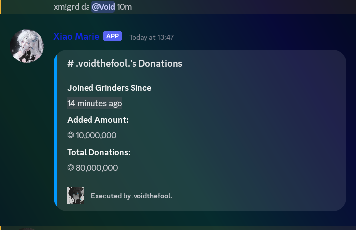
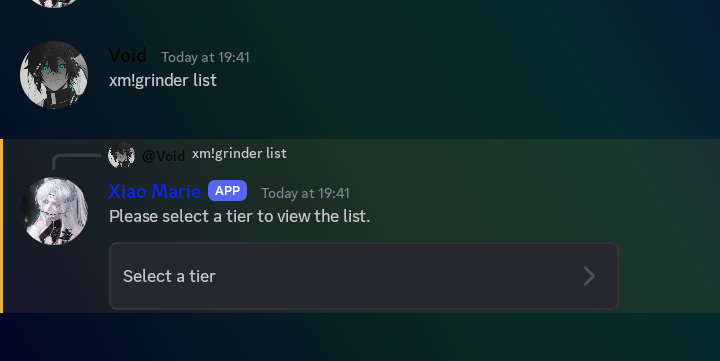
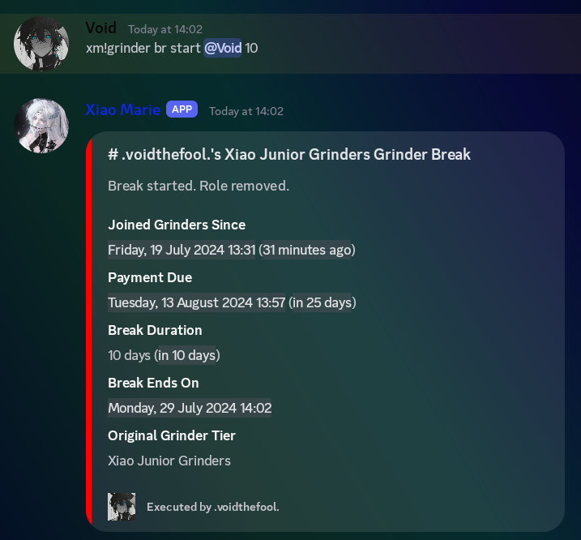
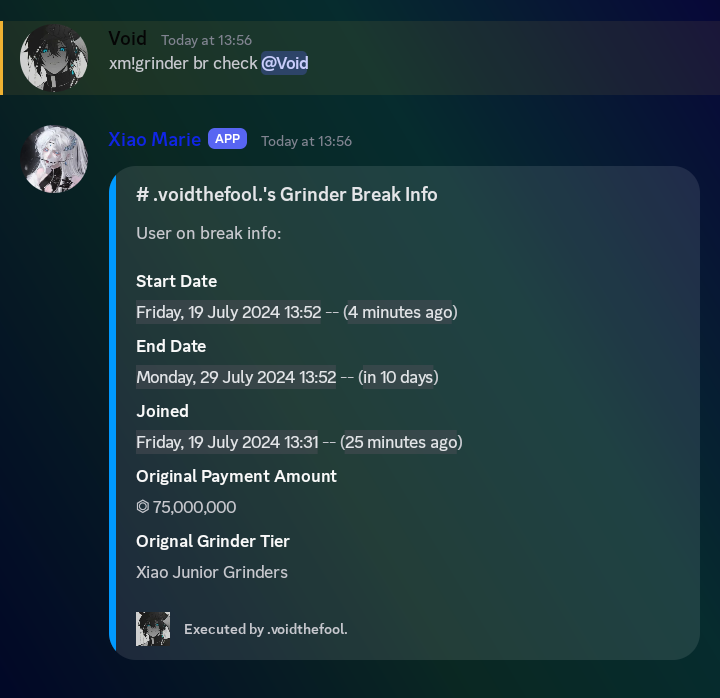
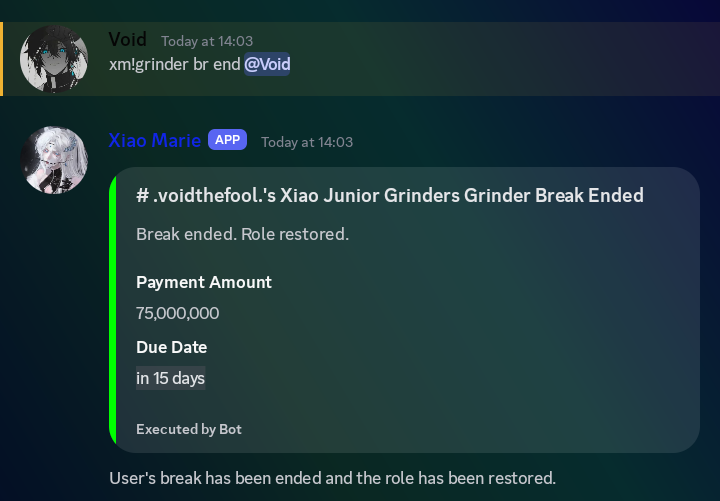
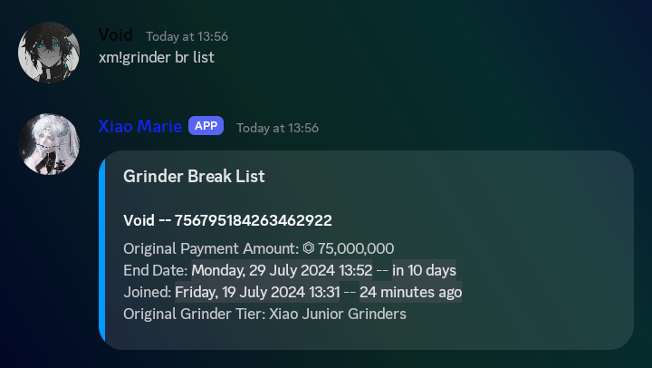

import { Callout } from 'nextra-theme-docs'

## Grinders Command Usage

### Command Prefix

All commands use the prefix **`!`** by default. To find out the prefix of your server, try mentioning the bot.

### Grinder Command Aliases

The primary command for grinders is **`grinder`**, but it can also be called using the aliases **`g`** or **`gr`** or **`grd`**.

## Commands and Examples

### Add Grinder

**Description:** Adds a new grinder, mentioned `<@user>` to the system.

**Command:** **`!grinder add @user`**

**Aliases:**
- `!g add @user`
- `!gr a @user`
- `!grd + @user`

**Args:**
- `@user`: The user mention to be added as a grinder.

**Example:**
- `!grinder add @Tea Lover`

### Check Grinder

**Description:** Retrieves the current status and information for the grinder mentioned `<@user>`.

**Command:** `!grinder check @user`

**Aliases:**
- `!g check @user`
- `!gr c @user`
- `!grd check @user`

**Args:**
- `@user`: The user mention to be checked.

**Example:**
- `!grinder check @Coffe Guy`

### Add Grinder Donation

**Description:** Adds a donation for a grinder.

**Command:** `!grinder donoadd @user <amount>`

**Aliases:**
- `!g donoadd @user <amount>`
- `!gr da @user <amount>`
- `!grd donoadd @user <amount>`

**Args:**
- `@user`: The user mention for the donation.
- `<amount>`: The donation amount.

**Example:**
- `!grinder donoadd @Rumbler 50m`

### Remove Grinder Donation

**Description:** Removes a donation for a grinder.

**Command:** `!grinder donoremove @user <amount>`

**Aliases:**
- `!g donoremove @user <amount>`
- `!gr dr @user <amount>`
- `!grd donoremove @user <amount>`

**Args:**
- `@user`: The user mention for the donation.
- `<amount>`: The amount to be removed.

**Example:**
- `!grinder donoremove @Parry Hotter 60m`

### List Grinders

**Description:** Lists all grinders.

**Command:** `!grinder list`

**Aliases:**
- `!g list`
- `!gr l`
- `!gr ls`
- `!grd list`

**Args:** None

**Example:**
- `!grinder list`

### Remove Grinder from Database

**Description:** Removes a user from the grinders database.

**Command:** `!grinder remove @user`

**Aliases:**
- `!g remove @user`
- `!gr - @user`
- `!gr rm @user`
- `!grd remove @user`

**Args:**
- `@user`: The user mention to be removed.

**Example:**
- `!grinder remove @Onion`

### Check Retired Grinders

**Description:** Checks details of retired grinders.

**Command:** `!grinder checkRetired @user`

**Aliases:**
- `!g checkretired @user`
- `!gr cr @user`
- `!grd cr @user`

**Args:**
- `@user`: The user mention to be checked.

**Example:**
- `!grinder checkretired @Gambling Addict`

### Demote Grinder

**Description:** Demotes the grinder named `<@user>` to a lower tier.

**Command:** `!grinder demote @user <tier_name>`

**Aliases:**
- `!g demote @user <tier_name>`
- `!gr d @user <tier_name>`
- `!grd demote @user <tier_name>`

**Args:**
- `@user`: The user mention to be demoted.
- `<tier_name>`: The name of the tier you want to demote to.

<Callout type="info" emoji="ℹ️">
  The tier name is Case Sensitive.
</Callout>

**Example:**
- `!grinder demote @Carrot Xiao Junior Gridners`

### Promote Grinder

**Description:** Promotes the grinder named `<@user>` to a higher tier.

**Command:** `!grinder promote @user <tier_name>`

**Aliases:**
- `!g promote @user`
- `!gr p @user`
- `!grd promote @user`

**Args:**
- `@user`: The user mention to be promoted.
- `<tier_name>`: The name of the tier you want to demote to.

<Callout type="info" emoji="ℹ️">
  The tier name is Case Sensitive.
</Callout>

**Example:**
- `!grinder promote @Capsicum Xiao High Grinders`

### Break Management

### Start Break for a grinder

**Description:** 
Initiates a break for the grinder mentioned `<@user>`, specifying the break duration `<duration>` (format needs to be an integer). The maximum number of break days available is 24 

**Command:** `!grinder break start @user <duration>`

**Aliases:**
- `!g break start @user <duration>`
- `!gr b start @user <duration>`
- `!grd break start @user <duration>`

**Args:**
- `@user`: The user mention to start a break.
- `<duration>`: The duration days of the break in numbers.

**Example:**
- `!grinder break start @AFK 10`

### Check Break for a grinder

**Description:** Retrieves the remaining time for an ongoing break associated with the grinder mentioned `<@user>`.

**Command:** `!grinder break check @user`

**Aliases:**
- `!g br c @user`
- `!gr break c @user`
- `!grd break check @user`

**Args:**
- `@user`: The user mention to check the break status.

**Example:**
- `!grinder break check @AFK`

### End Break for a grinder (manually)

**Description:** Forces an end to the ongoing break for the grinder mentioned `<@user>`.

**Command:** `!grinder break end @user`

**Aliases:**
- `!g break end @user`
- `!gr b end @user`
- `!grd br end @user`

**Args:**
- `@user`: The user mention to end the break.

**Example:**
- `!grinder break end @AFK`

### List Grinder Breaks

**Description:** Lists all grinders currently on a break.

**Command:** `!grinder break list`

**Aliases:**
- `!g break list`
- `!gr b list`
- `!grd br list`

**Args:** None

**Example:**
- `!grinder break list`

## Note

* Aliases provide flexibility in using the commands. You can use any of the listed variations for each command.
* Refer to the specific command descriptions for detailed information on arguments, usage, and expected behavior.
